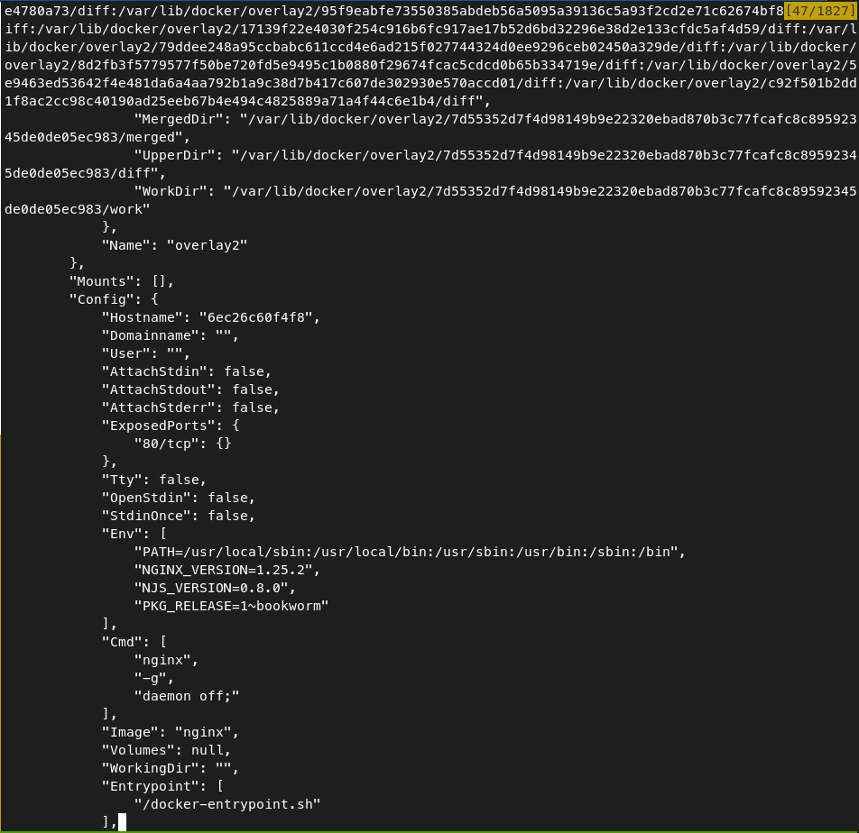
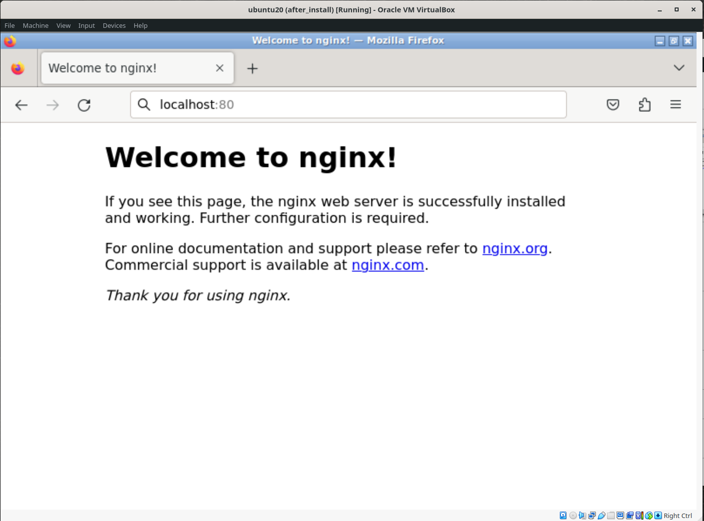
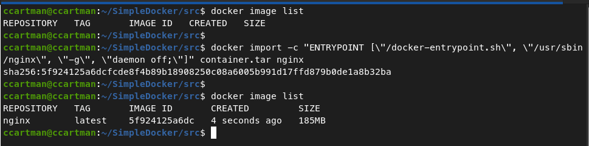
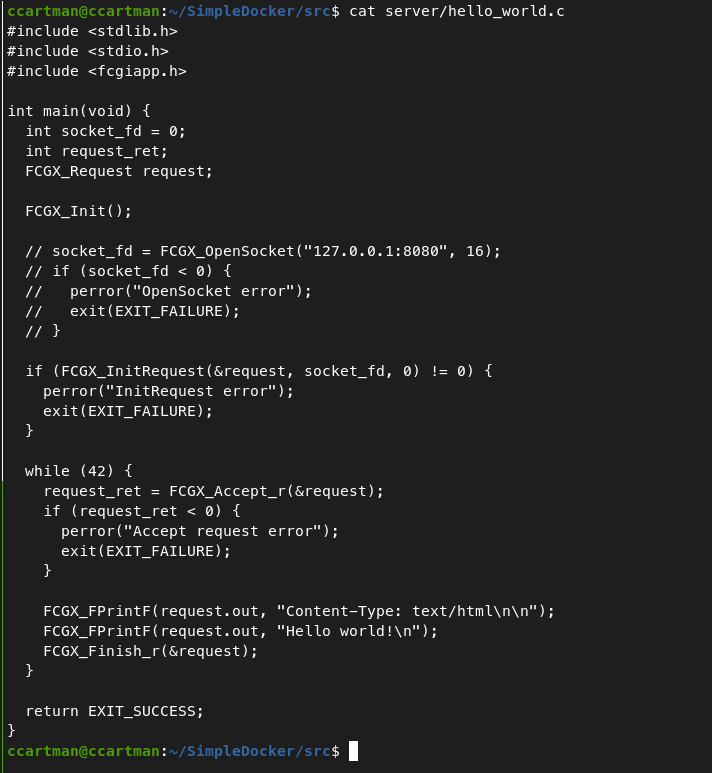

# Simple Docker. Report

## Contents

1. [Ready-made docker](#part-1-ready-made-docker)
2. [Operations with container](#part-2-operations-with-container)
3. [Mini web server](#part-3-mini-web-server)
4. [Your own docker](#part-4-your-own-docker)
5. [Dockle](#part-5-dockle)
6. [Basic Docker Compose](#part-6-basic-docker-compose)

## Part 1. Ready-made docker

- Take the official docker image from nginx and download it using `docker pull nginx`. \
  
- Check for the docker image with `docker images`. \
  
- Run docker image with docker `run -d nginx`. \
  
- Check that the image is running with `docker ps`. \
  
- View container information with `docker inspect 6ec26c60f4f8`. \
   \
   \
   \
  
  
- From the command output define and write in the report the container size, list of mapped ports and container ip:
  - size is `67108864`; \
    
  - mapped ports list is `"80/tcp": null`; \
    
  - ip is `172.17.0.2`; \
    
- Stop docker image with docker stop 6ec26c60f4f8. \
  
- Check that the image has stopped with `docker ps`. \
  
- Run docker with ports 80 and 443 in container, mapped to the same ports on the local machine, \
  using command `docker run -d -p 127.0.0.1:80:80 -p 127.0.0.1:443:443` \
  
- Check that the nginx start page is available in the browser at `localhost:80`. \
  
  - Pre-install xinit, openbox, firefox on a virtual machine.
  - Then open the window manager with the `startx` command, right-click open `firefox`.
- Restart docker container with `docker restart [container_id|container_name]`. \
  Then check in any way that the container is running. \
  

## Part 2. Operations with container

- Read the nginx.conf configuration file inside the docker container with the exec command. \
  Run docker with name nginx_container  with ports 80 and 443 in container using command: \
  `docker run -d -p 127.0.0.1:80:80 -p 127.0.0.1:443:443 --name nginx_container nginx`\
  Then read config using command: \
  `docker exec -it nginx_container sh -c "cat /etc/nginx/nginx.conf"` \
  
- Create a nginx.conf file on a local machine. \
  We use redirection of the standard stream to a file nginx.conf: \
  `docker exec -it nginx_container sh -c "cat /etc/nginx/nginx.conf" >nginx.conf`
  
- Configure it on the /status path to return the nginx server status page. \
  let's change the configuration: \
  
- Copy the created nginx.conf file inside the docker image using the docker cp command: \
  `docker cp nginx.conf nginx_container:/etc/nginx` \
  
- Restart nginx inside the docker image with exec: \
  `docker exec -it nginx_container sh -c "nginx -s reload"` \
  
- Check that localhost:80/status returns the nginx server status page: \
   \
  
- Export the container to a container.tar file with the export command \
  `docker export --output="container.tar" nginx_container` \
  
- Stop the container: \
  `docker stop nginx_container` \
  
- Delete the image with docker rmi [image_id|repository]without removing the container first: \
  `docker rmi -f nginx` \
  
- Delete stopped container: \
  `docker container rm nginx_container` \
  
- Import the container back using the import command: \
  `docker import -c "ENTRYPOINT [\"/docker-entrypoint.sh\", \"/usr/sbin/nginx\", \"-g\", \"daemon off;\"]" container.tar nginx` \
  
- Run the imported container: \
  `docker run -d -p 80:80 --name nginx_container nginx` \
  
- Check that localhost:80/status returns the nginx server status page: \
   \
  

## Part 3. Mini web server

- First install gcc, libfcgi, spawn-fcgi, nginx on virtual machine: \
  `$> sudo apt install gcc` \
  `$> sudo apt install libfcgi-dev` \
  `$> sudo apt install spawn-fcgi` \
  `$> sudo apt install nginx`
- Write a mini server in C and FastCgi that will return a simple page saying Hello World! \
  
- Run the written mini server via spawn-fcgi on port 8080: \
  `$> gcc server/hello_world.c -o server/hello_world -lfcgi` \
  `$> spawn-fcgi -p 8080 server/hello_world` \
  
- Write your own nginx.conf that will proxy all requests from port 81 to 127.0.0.1:8080 \
   \
  then `$>sudo cp nginx/ngnix.conf /etc/nginx/conf.d` \
  then `$>sudo nginx -t` \
  then `$>sudo nginx -s reload` \
  
- Check that browser on localhost:81 returns the page you wrote \
  
  
## Part 4. Your own docker

- Write your own docker image that: 
  1) builds mini server sources on FastCgi 
  2) runs it on port 8080 
  3) copies inside the image written ./nginx/nginx.conf 
  4) runs nginx 
  
- Build the written docker image with docker build, specifying the name and tag: \
  `docker build -t hello_world:latest . ` \
  
- Check with docker images that everything is built correctly \
  
- Run the built docker image by mapping port 81 to 80 on the local machine and mapping the ./nginx folder inside the container \
  `docker run -d -p 80:81 -v ./nginx:/etc/nginx/conf.d --name hello hello_world:latest` \
  
- Check that the page of the written mini server is available on localhost:80 \
  
- Add proxying of /status page in ./nginx/nginx.conf to return the nginx server status \
  
- Restart docker image; \
  Check that localhost:80/status now returns a page with nginx status: \
  

## Part 5. Dockle

- Check the image from the previous task with dockle [image_id|repository] \
  
- Fix the image so that there are no errors or warnings when checking with dockle: \
   \
  
  
## Part 6. Basic Docker Compose

- Write a docker-compose.yml file, using which:
  1) Start the docker container from Part 5;
  2) Start the docker container with nginx which will proxy all requests \
     from port 8080 to port 81 of the first container
  
  
- Stop all running containers \
  
- Build and run the project with the `docker-compose build` and `docker-compose up` commands: \
   \
  
- Check that the browser returns the page you wrote on localhost:80 as before: \
   \
   \
  
  
 

  

  
